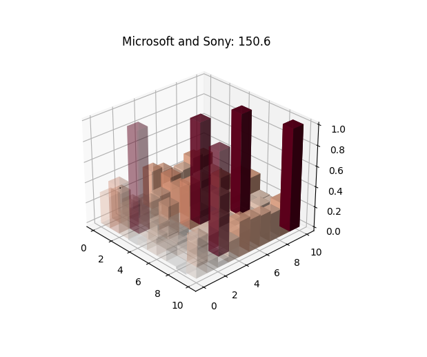
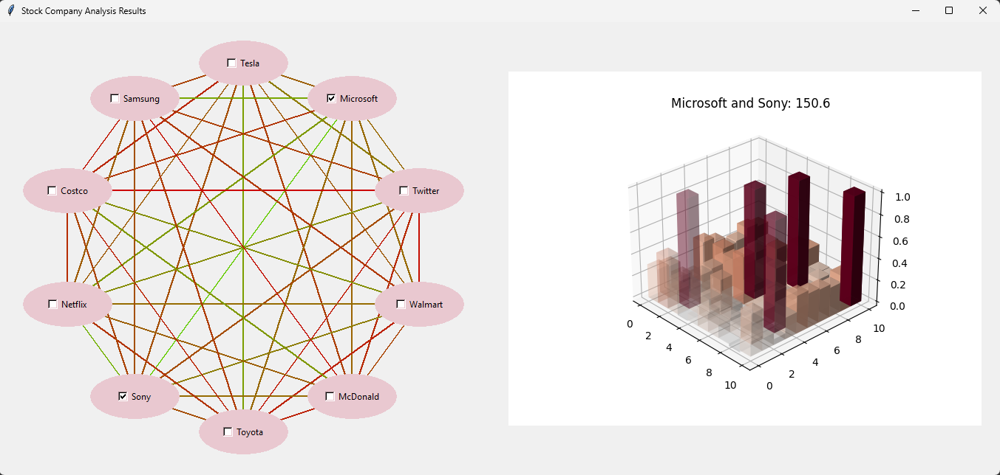
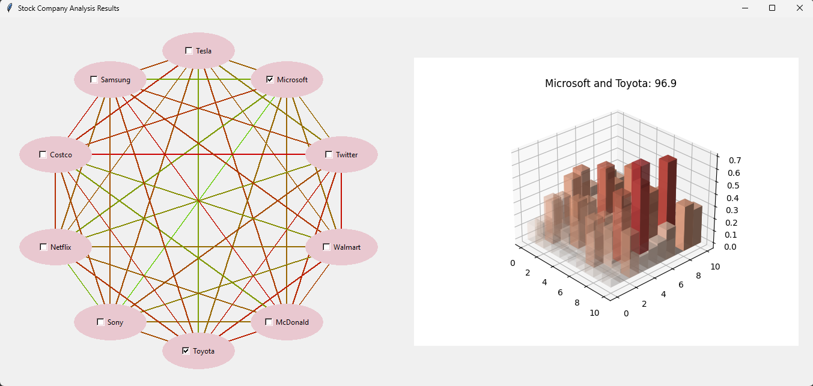

# Stock Prediction Program Through Relationship Analysis between Companies  

This program predicts future stock movements primarily based on news article analysis. As a basis, the program computes a vector space model of news articles regarding certain companies to quantify the associativity between different companies. For prediction, the program uses sentiment analysis on recent news articles to first predict a general trend for individual companies, then uses the computed associativity values to further adjust predictions. 

## Periods of Development  
- September 3, 2022 - Ongoing 

## Development Environment  
- 'Python 3.10'  
- 'Database: SQLite'

## Core Features  

### Crawling & Natural Language Processing ([DataBase.py](DataBase.py))  
Our objective is to retrieve relevant article information from online news sources and process them with NLP.  

Libraries used: selenium, bs4, nltk  
- selenium: Library used to control web browser (Google Chrome). Controls browser through webdriver with chromedriver.exe separately downloaded.  
- bs4: Library used to access html code & retrieve tags. Used for each Google page to retrieve article links. Used for each article link to retrieve article text.  
- nltk: Library used for natural language processing. After manually removing stopwords, each remaining word's parts of speech is found via pos_tag & words are reverted to their roots via WordNetLemmatizer.  

The program uses Chrome to search Google with the query "(*company name*) company (*source*)", where (*source*) refers to the news source used (in this case, The Guardian). 10 Google search results pages and their html codes are used to extract and save all new links from the news source (if the link already exists in the database or is not from the news source, the program continues). Each article link is then individually accessed and its html code used to extract the article's main text.  

For each article text, all stopwords are removed and all remaining words' parts of speech are identified. 
Both the words and their parts of speech are then inputted into a lemmatizer, which reverts each word back into its root form. 
This is done to avoid various forms of a word being incorrectly identified as different words (ex. eat, eats, ate, eating, eaten, etc), and improves document frequency accuracy. 

The frequency of each root word is then identified for each article and is appended to a string in SQL format, which is then
added to the SQL Database for each article.

### SQL ([DataBase.py](DataBase.py), [ArticleDatabase.db](ArticleDatabase.db]))  
SQL Database "article_database" is used to store parsed article information for later access & analysis.

Table: Articles  
- Columns (3): Article_ID, Word_Frequency, Stocks  
- Article_ID: Stores article links, used as unique ID for that article's information  
- Word_Frequency: Stores document frequency of each word in string format --> (*word1*, *frequency1*), (*word2*, *frequency2*),...  
- Stocks: Stores relevant stocks included in article (as multiple companies can be mentioned in one article)

### TF-IDF ([System.py](System.py))  
The objective of calculating the tf-idf of each word for each individual document is to quantify the relevant importance of each word for the document in respect to the overall collection of words across all documents — in other words, the weight of each word as a keyword. 
The term "tf" refers to "term frequency", and "idf" refers to "inverse document frequency". 

The equation for tf-idf is

$$W_{i, j} = tf_{i, j} \times \log(\frac{N}{1+df_i})$$

where 

$$
tf_{i, j} = \text{frequency of term $i$ in document $j$} \\
df_i = \text{number of documents containing $i$} \\
N = \text{total number of documents}. \\
$$

Here, each "document" refers to individual stocks; thus, multiple word frequencies across all articles relevant to a certain stock are combined to form the term frequency for each word.  

However, even though the term frequency may be high, its importance may not be. This is determined by how often the term presents itself throughout multiple documents — a term with both a high term frequency and high document frequency is likely unimportant and can be disregarded, whereas a term with a high term frequency within a certain document but low document frequency is likely important, and thus should be considered a keyword for that document.  

The term frequency and inverse of the document frequency is multiplied to form the tf-idf for each word within each stock, such that the higher the td-idf value, the more likely it is to be a keyword for that relevant stock. The inverse document frequency is logarithmized to control excessive inflation of values.

### Word Associativity  
To quantify the correlation between two companies/stocks, 10 keywords with the highest tf-idf values in each stock will be used for comparison. Let us consider two stocks: $S_1$ and $S_2$. 

Comparing every word in $S_1$ with every word in $S_2$ yields a correlation value between 0 and 1, for a total of 100 values. Here, two words having low correlation is irrelevant; as long as there exists some words with high correlation, $S_1$ and $S_2$ can be considered as correlated. As a basis, a correlation value over 0.25 indicates notable similarity. Thus, each value will be divided by 0.25 and squared, such that values over 0.25 will be amplified and values below 0.25 will decrease in significance. The sum of the results will yield a final correlation value $R_{1,2}$ between $S_1$ and $S_2$. This process will be repeated for all pairs of stocks within the program.

$$R_{i,j} = \sum(sim(w_a, w_b) \times \frac{1}{0.25})^2 \quad (\forall w_a \in S_i,\ \forall w_b \in S_j)$$

The correlation value between two words $sim(w_1, w_2)$ will be computed with the library Spacy, using the vector space model "en_vectors_web_lg".

A visual display of the individual relations of keywords for two stocks can be seen below in Figure 1.

<figure>
  

    
  

  <figcaption>
    Figure 1 - 3D bar graph plotting the 10 keywords for each stock on the x, y axes and the correlation score on the z axis 
  </figcaption>
</figure>

The collective correlation values for all stocks will be visually displayed using Tkinter, with the GUI window split in half. The left half will display a graph of stocks as nodes and relations as edges, colored with green/red based on the stocks' correlation values. Selecting two stocks will update the right half, displaying a 3d bar graph of keyword relations similar to Figure 1. Such examples are displayed below in Figure 2.1 ~ 2.3. 

<figure>
  
  <figcaption>
    Figure 2.1 - Tkinter display for two stocks with high correlation
  </figcaption>
</figure>

<figure>
  
  <figcaption>
    Figure 2.2 - Tkinter display for two stocks with medium correlation
  </figcaption>
</figure>

<figure>
  
  <figcaption>
    Figure 2.3 - Tkinter display for two stocks with low correlation
  </figcaption>
</figure>

##Reference
- Christopher D. Manning et al., 2008, Introduction to Information Retrieval (8th Edition)
